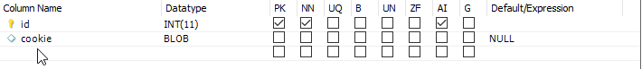

# Requirements

## Heroku

### Addons
- ClearDB MySQL

### Buildpacks
- heroku/python
- https://github.com/heroku/heroku-buildpack-google-chrome
- https://github.com/heroku/heroku-buildpack-chromedriver
- https://github.com/heroku/heroku-buildpack-python.git
- https://github.com/heroku/heroku-buildpack-apt.git

### Config Vars (First 2 have to be in order)
- BUILDPACK_URL : git://github.com/heroku/heroku-buildpack-python.git
- CHROMEDRIVER_PATH : /app/.chromedriver/bin/chromedriver
- CLEARDB_DATABASE_URL
- GOOGLE_CHROME_BIN : /app/.apt/usr/bin/google_chrome

# Setup
### bot.py
- Enter all your details
    #### Changing what lessons you want to see
    - under function screenshotAndSend, change the end of class3 (.../select/option[2] to the index of your desired lesson in the dropdown (If you're learning manual, class3a is index 3, class3 is index 2))
### conn.py
- Just update and add your credentials accordingly

### Uploading cookies
- Run uploadcookies.py
- Download geckodriver (https://github.com/mozilla/geckodriver/releases) and enter your path to it
- Login and do the captcha within a minute, if you fail just rerun
    
### ClearDB Setup
- 'auth' table
- 

---
#### Bot will break if you haven't completed 5 lessons yet because you can't see simulator lessons, to fix this just comment out lines 154-159 and 170-171 in bot.py